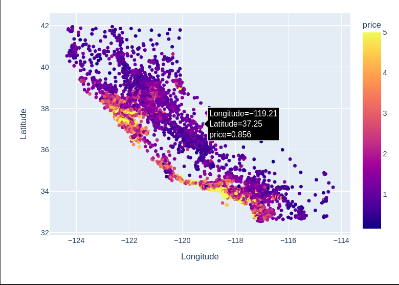

# ML-Project 1 - Interactive Visualization of California Housing Data



## Overview
This project aims to provide an interactive visualization of the California Housing Data, focusing primarily on plotting the data on a map according to the longitude and latitude, with house prices reflected visually. The visualization further allows users to filter data based on various housing features to better understand the distribution.

## Background
The California Housing Data is frequently utilized for various data science tasks. While static plots can offer insightful information, in certain applications, interactivity can enhance the user's understanding and allow for real-time data manipulation. This project offers just that – an interactive experience for users to filter and view housing data as per their specific interests.

## How to use 
You can download the notebook and test it using google colab. Use the interactive plot outputted by plotly express, and test adjusting the sliders to have different interactive plots based on the sliders filtering. 

## Dataset

The dataset utilized is the California Housing Data, which can be fetched directly from the `sklearn.datasets` module.

## Implementation Details

1. **Data Loading and Preparation**:

    The California Housing Data is loaded using `sklearn`, and a pandas DataFrame is created for easier manipulation.

    ```python
    from sklearn.datasets import fetch_california_housing
    cal_housing = fetch_california_housing(data_home='.')
    import pandas as pd
    df = pd.DataFrame(np.hstack([X,avg_price[:,np.newaxis]]), columns=np.hstack([feature_names,'price']))
    ```

2. **Visualization with Plotly Express**:

    This provides a scatter plot of the dataset, with each point corresponding to a location (Longitude and Latitude) in California, colored based on the house price.

    ```python
    import plotly.express as px
    
    fig = px.scatter(df, x='Longitude', y="Latitude", color='price')
    fig.show()
    ```

3. **Interactive Filtering with ipywidgets and plotly**:

    Users can interactively adjust sliders to filter the housing data based on features such as HouseAge, AveRooms, and more. The visualization updates in real-time, reflecting the user's choices.

    ```python
    import ipywidgets as widgets
    import plotly.express as px

    # ... [code to define sliders and filter function] ...

    widgets.interactive(filter_data, house_age_range=house_age_slider, price_range=price_slider, ...)
    ```

4. **Additional Visualization Methods**:

    Other visualization methods explored include:

    - **Folium Library**: Implements the data points on an actual map, resembling platforms like Google Maps. It successfully plots the points but lacks certain interactive capabilities.
    - **Bokeh Plotting Library**: Sets up an HTML interactive plot that can be viewed within a notebook or a new HTML window. Although it provides comprehensive interactivity, there were challenges in updating the visualization based on user filters.

