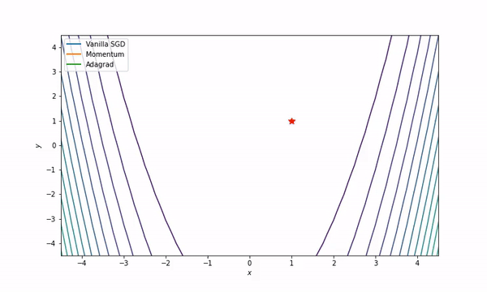
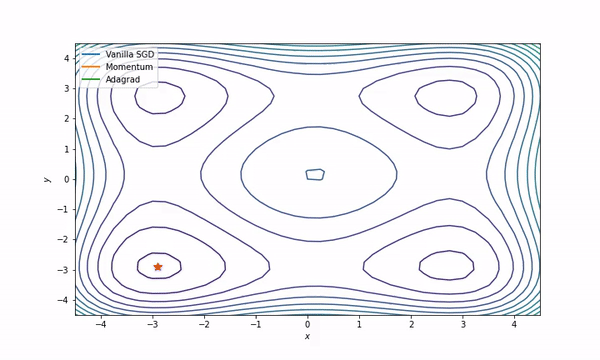

# ML-Project 2 - SGD Extensions and Variants Implementation & Animation 

The final visualization showcases the paths of the three SGD variants on the Rosenbrock and Styblinski-Tang function's contours.

Rosenbrock Animation 

Styblinski_tang Animation 

## Description

In this project, we've implemented three optimization methods:
1. Vanilla Stochastic Gradient Descent (SGD)
2. Momentum-based SGD
3. Adagrad

All three methods were applied to two objective functions:
1. Rosenbrock Function
2. Styblinski-Tang Function

The performance of the optimization methods was visualized using animations, showcasing their solution paths on the functions' contours.

## How to Use

### Implementation

1. **Objective Functions**:
   - The Rosenbrock Function: `((1 - x)**2) + (100*((y - x**2)**2))`
   - The Styblinski-Tang Function: `0.5 * ((x**4 + y**4) - 16 * (x**2 + y**2) + 5 * (x + y))`
  
2. **SGD Implementations**:
   
   - **Vanilla SGD**:
     - Gradient descent steps based on the simple update rule with a learning rate.
     - Defined in the function named `DerrivRosenbrock1`.
   
   - **Momentum**:
     - Uses the past gradients to make more informed updates to the current position.
     - Implemented by combining the derivative with a portion of the previous update.
   
   - **Adagrad**:
     - Adapts the learning rates of all model parameters by scaling them inversely proportional to the square root of the sum of all their historical squared values.
     - Helps to modify the learning rate for each parameter differently.
   
   
## Results Interpretation

By running the provided code, you can obtain the path of the three optimization methods on the function's contour plots. This gives an insight into how each method behaves in the optimization landscape:

- How fast they converge.
- The stability of the methods.
- If and where they get stuck.

## Additional Resources

For more details on SGD and its variants, refer to [Stochastic Gradient Descent - Wikipedia](https://en.wikipedia.org/wiki/Stochastic_gradient_descent#Extensions_and_variants).