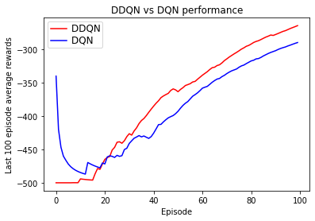

# ML-Project3 -  Learning Robotic Control for the Double Pendulum by using Double DQN with Prioritized Experience Replay

## Overview:

The goal of this project was to learn a control policy to solve the Acrobot-v1 task, a classic control problem where a two-link robot with pivoting joints must swing its end to a specific location. For this, we implemented a Double DQN with prioritized experience replay and compared its performance to a standard DQN with uniform experience replay.

## Data Source:

- Acrobot Environment from OpenAI Gym: [Gym Library](https://www.gymlibrary.dev/environments/classic_control/acrobot/)
- Source Code: [OpenAI GitHub](https://github.com/openai/gym/blob/master/gym/envs/classic_control/acrobot.py)

## Key Classes & Methods:

1. **QNetwork**: 
   - Implements the Q-network model with methods to build, update, and get Q-values.

2. **PrioritizedReplayBuffer**:
   - Manages experience storage with prioritization. Supports methods to add experiences, sample them, and set priorities based on TD error.

3. **DoubleDQNAgent**:
   - Represents the Double DQN agent. Manages interactions with the environment, training, and action selection.

4. **AcrobotVisualizer**:
   - Provides visualization functionalities to display error propagation.

**Training & Evaluation**:

During training, the performance was visualized using both the standard DQN and the Double DQN methods, in separate runs, showing the effectiveness of the Double DQN with prioritized experience replay. Evaluation criteria included cumulative regret as a function of training episodes.

**Key Results**:

Double DQN with prioritized experience replay significantly outperformed the standard DQN, showcasing higher average rewards and solving the environment in fewer episodes.

**Documentation**:

A comprehensive report detailing the approach, experimentation, and results has been compiled in a form of a paper. The paper is shown [here](https://github.com/amashry/CV-ML-Projects/tree/main/ML-Projects/project3-Acrobot-Reinforcement-Learning/report)